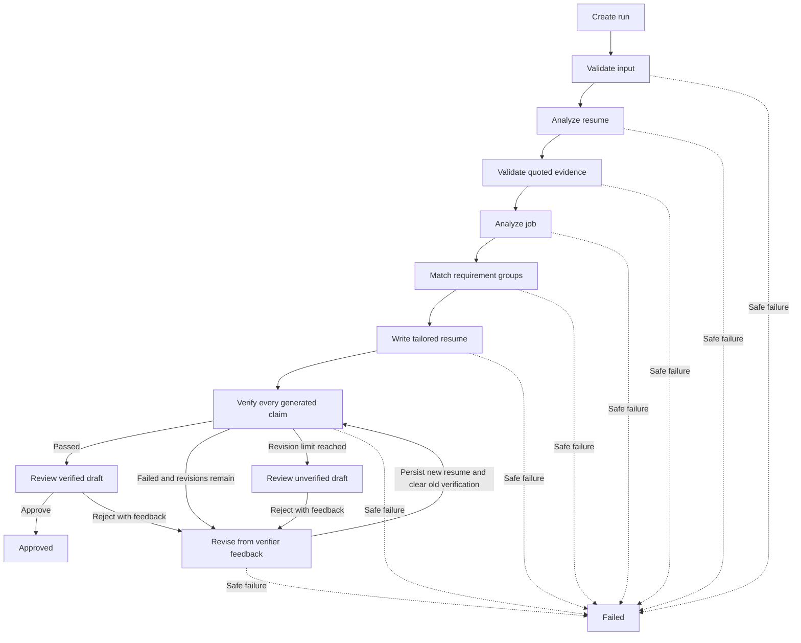
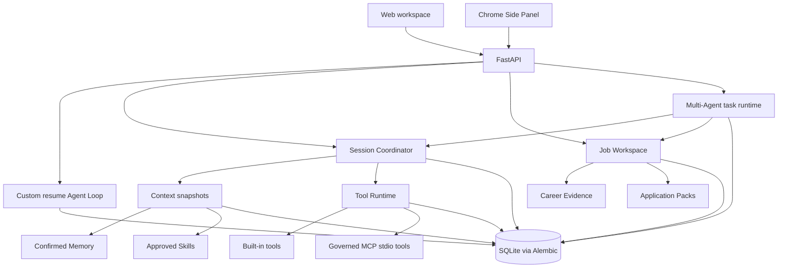
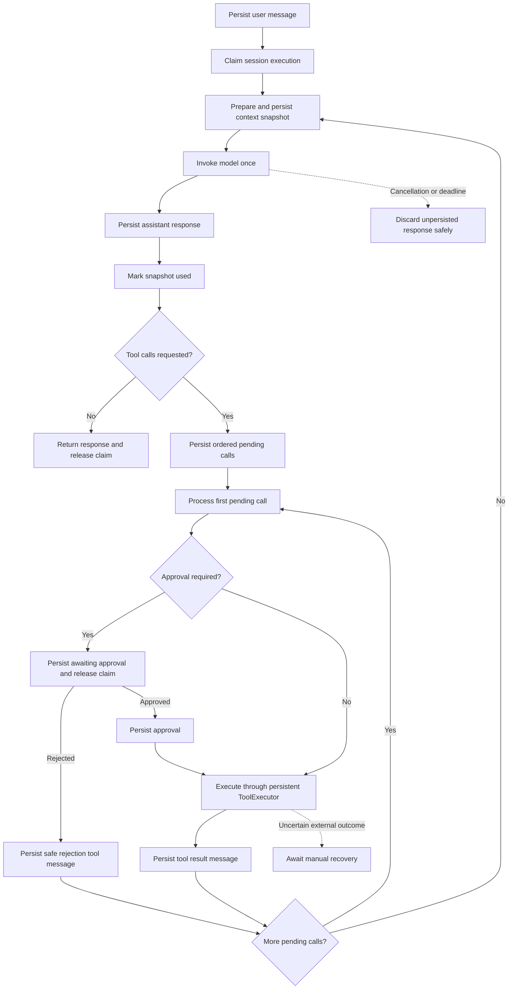
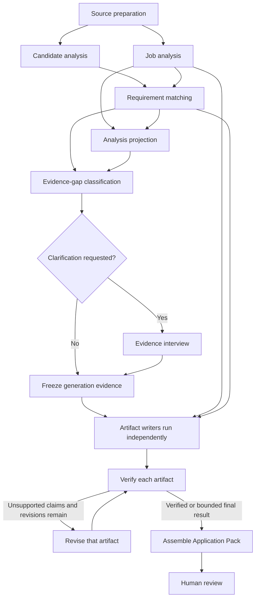

# JobHunterAgent

JobHunterAgent is a local-first career copilot for saving job postings, comparing
them with a resume, producing evidence-grounded application materials, and managing
the conversations and review steps around an application.

The project has two user-facing surfaces:

| Surface | Purpose |
|---|---|
| **Web workspace** | Full job workspace, resume management, Copilot conversations, application materials, evidence, interviews, and governed learning |
| **Chrome Side Panel** | Lightweight extraction and fit analysis for the job currently open in the browser |

The web workspace runs at `http://localhost:8000/app`. The extension always talks to
the same local service at `http://localhost:8000`.

## What it does

- Saves jobs with title, company, location, original URL, and a cleaned job description.
- Accepts selectable-text PDF resumes and keeps one resume as the default.
- Splits compound job requirements into deterministic requirement groups.
- Distinguishes matched, partial, missing, and user-confirmation requirements.
- Grounds generated resume claims in quoted resume or user-confirmed evidence.
- Verifies drafts and uses a bounded revision loop before human review.
- Generates tailored resumes, cover letters, and application answers as versioned artifacts.
- Exports tailored resumes as searchable, ATS-friendly Letter-size PDFs.
- Persists Copilot conversations and lists them in a ChatGPT-style sidebar.
- Supports resumable tool calls, approvals, cancellation, deadlines, and recovery.
- Keeps Memory and Skills governed, versioned, reviewable, and separate from resume evidence.

### Resume agent loop

The active custom backend persists state and an audit event after every completed
step. Human review is a durable pause rather than a long-running in-memory request.



Only `awaiting_review` and `approved` states publish a stable public result. During
revision, the latest complete result may remain stored for audit purposes, while the
run status shows that it is no longer the current completed version.

## Quick start

### 1. Create an environment

Windows PowerShell:

```powershell
py -m venv .venv
.\.venv\Scripts\Activate.ps1
python -m pip install -r requirements.txt
```

macOS or Linux:

```bash
python3 -m venv .venv
source .venv/bin/activate
python -m pip install -r requirements.txt
```

### 2. Configure the model

Create a `.env` file in the repository root:

```dotenv
LLM_MODEL_ID=your-model-id
LLM_API_KEY=your-api-key

# Optional for an OpenAI-compatible provider
LLM_BASE_URL=https://provider.example/v1

# Optional; defaults are provider timeout behavior and zero retries
LLM_TIMEOUT=60
LLM_MAX_RETRIES=0
```

`LLM_MAX_RETRIES=0` keeps one logical model invocation aligned with one provider
request during evaluations. Do not commit `.env`.

### 3. Initialize the database

```powershell
python -m alembic upgrade head
```

Production startup relies on Alembic. SQLAlchemy `create_all()` is used only by
isolated tests.

### 4. Start the local service

```powershell
python -m uvicorn api.main:app --host 127.0.0.1 --port 8000
```

Open:

- Web workspace: <http://localhost:8000/app>
- OpenAPI documentation: <http://localhost:8000/docs>
- Health check: <http://localhost:8000/health>

### 5. Complete the first-use setup

1. Open **Settings** in the web workspace.
2. Upload a PDF resume containing selectable text.
3. Save a job or install the Chrome extension.
4. Run **Analyze fit**.
5. Use Copilot or Materials to continue the application workflow.

The resume upload stores extracted text, document metadata, and a content hash in
SQLite. It does not retain the original PDF bytes. Scanned-image PDFs require OCR
and are rejected in the current version.

## Chrome extension

The extension is intentionally smaller than the web application. It can:

- detect the title, company, location, URL, and job description on the active page;
- automatically extract the visible LinkedIn job when the Side Panel opens;
- keep the extracted fields editable before anything is submitted;
- save the job into the web workspace;
- compare it with the default resume and show a match score and suggestions;
- open the saved application in the full web workspace.

**Analyze fit** uses the analysis-only pipeline: input validation, resume evidence
analysis, job analysis, and requirement matching. It makes three logical model calls
and does not write or verify a tailored resume, create a reviewable run, or enter
human review. Full `/runs` and Application Pack workflows retain the complete
write/verify/revise/review lifecycle.

Install it locally:

1. Start the FastAPI service.
2. Open `chrome://extensions`.
3. Enable **Developer mode**.
4. Select **Load unpacked**.
5. Choose the repository's `chrome_extension` directory.
6. Open a normal HTTP(S) job page and click the extension icon.

LinkedIn changes its page structure regularly. **Extract page** remains available
as a manual fallback. The extension never sends extracted text until the user
selects **Analyze fit** or **Save job**.

The extension requests only:

- `activeTab`
- `scripting`
- `storage`
- `sidePanel`
- host access to `http://localhost:8000/*`

It does not request broad browsing history, cookies, downloads, `webRequest`, or
`<all_urls>` access.

## Web workspace

### Jobs

Saved jobs keep their source URL and immutable description snapshots. Reopening a
job shows its latest analysis and application materials without requiring the
original page to remain open.

### Copilot

Copilot conversations are durable and listed in a left sidebar. Messages appear
optimistically while a model turn is running, and failed sends remain visible for
editing and retry. A conversation can be reopened or archived without deleting its
audit history.

Copilot uses a server-owned read-only capability profile. The browser cannot submit
arbitrary tools, model IDs, system prompts, API keys, or permission metadata.

### Materials

Application Packs contain versioned tailored resumes, cover letters, application
answers, verification results, and review state. Generated claims remain subject to
the same evidence rules during revision. Tailored resumes can be downloaded as PDF
or copied as text.

New resume drafts must bind every claim to a real extracted source entry and may not
use `legacy:*` source IDs. Entry headings, organizations, locations, and dates are
checked against that source entry before a draft is persisted. The explicit v1
artifact upgrader retains `legacy:*` IDs only so historical artifacts remain
readable; it is not a generation fallback.

### Evidence and learning

Career Evidence records user-confirmed facts independently from generated artifacts.
Conversation learning may propose Memory candidates, but only confirmed Memory can
enter future context. Memory confirmation never turns a statement into resume
evidence automatically.

Skills use standards-compatible `SKILL.md` packages with validation, hashing,
approval, activation, and retirement. Skill tool declarations may narrow runtime
permissions but cannot expand them.

### Interviews

Evidence interviews clarify missing application evidence. Mock interviews provide
job-specific practice and coaching. Both are persisted and can resume after a
process restart; neither may silently confirm new career evidence.

## Architecture



### Copilot and tool loop

Each model decision and each individual tool call has its own persistence boundary.
The coordinator never keeps a database transaction open while waiting for a provider
or tool.



The context snapshot fixes the exact policy, Skill versions, Memory versions,
conversation groups, evidence sources, and effective tools used for a model call.
Recovery reuses that snapshot instead of silently selecting newer context.

### Multi-Agent application workflow

The Multi-Agent runtime coordinates a server-defined application plan. It is an
opt-in orchestration path behind application preparation, not a separate chat persona
or a user-selectable execution-mode switch. The model cannot invent child agents,
dependencies, permissions, or budgets.



The runtime provides:

- **Deterministic planning.** Python builds and validates the DAG before any worker
  runs. Unknown task types, cycles, invalid dependencies, excessive depth, or budgets
  outside server limits are rejected.
- **Isolated child sessions.** Each task receives declared input artifacts and a
  scoped context. It does not inherit sibling conversations, arbitrary tools, or new
  permissions.
- **Dependency-aware scheduling.** `requires_success` blocks downstream work after a
  failed prerequisite; `requires_completion` lets pack assembly account for optional
  artifacts that ended without succeeding.
- **Bounded parallelism.** Ready tasks are claimed with leases and heartbeats, while
  the plan limits total tasks, depth, concurrent work, model calls, tool calls,
  tokens, cost, and deadlines.
- **Durable artifacts.** Analyses, evidence snapshots, drafts, verification reports,
  revisions, and the final pack are versioned outputs rather than hidden agent-to-agent
  messages.
- **Safe recovery.** Expired task claims can be recovered within attempt limits;
  cancellation, timeout, approval, and required user input remain explicit states.

The main application DAG currently prepares a tailored resume, cover letter, and up
to three application answers. Restricted questions remain manual. A failed required
artifact blocks final assembly, while optional artifacts are recorded according to
their terminal outcome. The resulting pack still requires human review.

Important boundaries:

- **Custom Agent is the active backend** for newly created runs.
- **LangGraph is frozen** and remains only for historical runs, baseline tests, and
  explicit evaluation runners.
- Schemas, prompts, model configuration, domain rules, rendering, and evaluation
  datasets are shared where behavior must remain comparable.
- The backend stored on an existing run is authoritative; environment defaults never
  reinterpret an old run.
- Model and tool calls execute outside database transactions.

## Persistence and recovery

The default database is `job_agent.db`. Historical LangGraph checkpoints use
`job_agent_checkpoints.sqlite`. Override the active database with:

```dotenv
JOB_AGENT_DATABASE_URL=sqlite:///./job_agent.db
```

SQLite foreign keys are enabled on every connection. Business state, events, and
public projections are committed transactionally with optimistic version checks.
Session execution uses time-bounded claims so one active attempt owns a running
session.

Recovery guarantees are deliberately conservative:

- completed tool results can be replayed into a missing session message without
  executing the tool again;
- expired read-only, side-effect-free, idempotent calls may retry within limits;
- uncertain write calls become `outcome_unknown` and require manual recovery;
- provider model calls are at-least-once if a process stops before the response is
  durably persisted;
- no exactly-once claim is made for external side effects.

## Optional MCP tools

MCP support is limited to governed local `stdio` servers. Configuration is loaded
from `MCP_CONFIG_PATH`; see `examples/mcp/local_test_config.json` for the local test
server format.

MCP tools enter the same registry, policy, approval, timeout, idempotency, provenance,
and persistence path as built-in tools. Current support does not include Streamable
HTTP, OAuth, resources, prompts, sampling, or elicitation.

## API overview

The complete contract is available from `/docs`. Main endpoint groups are:

| Prefix | Purpose |
|---|---|
| `/runs` | Resume workflow runs and human review |
| `/sessions` | Persistent Copilot conversations, messages, approvals, cancellation, and recovery |
| `/api/workspaces`, `/api/applications` | Saved jobs and application workspaces |
| `/api/resumes` | PDF resume upload and default resume selection |
| `/api/packs` | Application Pack generation and review |
| `/api/evidence` | Governed Career Evidence |
| `/memories`, `/skills` | Memory and Skill lifecycle management |
| `/api/interviews`, `/api/mock-interviews` | Evidence discovery and interview practice |
| `/api/applications/{id}/multi-agent-runs`, `/api/multi-agent-runs` | Governed application task plans, progress, cancellation, and resumption |
| `/api/assistant-sessions` | Safe conversation timeline and registered actions |

Client-facing errors are normalized. API responses do not expose API keys, complete
tracebacks, SQL, local paths, raw system prompts, or private tool results.

## Testing

Run the complete Python suite:

```powershell
python -m pytest -q
```

Run the browser-side unit tests:

```powershell
node --test tests/test_copilot_ui.mjs tests/test_learning_ui.mjs tests/test_mock_interview_ui.mjs
```

The current local release baseline is:

```text
638 passed, 1 skipped
18 JavaScript tests passed
```

Tests use fake models or scripted adapters by default and do not make paid model
calls. Live evaluations are opt-in. Reproducible datasets, runners, raw outputs, and
version metadata live under `evals/`.

GitHub Actions runs both commands on every push and pull request through
`.github/workflows/ci.yml`. It never runs a real-model evaluation. Live evaluations
remain explicit, paid, manual commands.

Human material-quality review uses 10–20 anonymized real resume/JD pairs and scores
factual accuracy, non-duplication, and application readiness. The governed local
packet format and privacy rules are in `evals/human_quality_review/README.md`.
Synthetic stability cases do not count as real-material review, and every failed
human review must identify a regression test before the packet validates.

Common evaluation commands:

```powershell
python -m evals.run_evals
python -m evals.run_stability_evals
python -m evals.run_requirement_intelligence_v3
```

These runners use the configured model and may make billable provider requests.
Unit tests remain offline by default.

Review the saved artifacts in `evals/results/` instead of combining results from
different prompt or dataset versions.

## Project layout

```text
JobHunterAgent/
|-- agent_runtime/       # Tool, session, context, memory, skill, MCP, and agent runtimes
|-- api/                 # FastAPI routes, schemas, dependencies, and services
|-- chrome_extension/    # Manifest V3 Side Panel extension
|-- custom_agent/        # Active persisted resume workflow loop
|-- job_agent/           # Shared schemas, prompts, model config, domain rules, rendering
|-- web_app/             # Full local web workspace
|-- migrations/          # Alembic schema history
|-- evals/               # Synthetic datasets, runners, and versioned results
|-- skills/              # Built-in, project, and generated Skill packages
|-- tests/               # Python and JavaScript tests
|-- examples/mcp/        # Local MCP example configuration and server
`-- scripts/             # Development smoke-test utilities
```

## Security and current limitations

This is a trusted, local, single-user application. It is not an authentication or
multi-tenant authorization boundary.

- Do not expose the service directly to an untrusted network.
- Resume text, job descriptions, feedback, generated artifacts, messages, and audit
  state are stored locally in SQLite.
- The browser extension treats webpage content as untrusted data and renders returned
  content with safe DOM APIs.
- Prompt instructions and structured output reduce risk, but deterministic evidence
  validation is the primary claim-safety boundary.
- SQLite is suitable for this local deployment, not high-throughput multi-worker use.
- Dynamic provider timeouts depend on provider support; Python cannot forcibly stop an
  in-flight remote request.
- LinkedIn extraction may require selector updates when its DOM changes.
- OCR, hosted authentication, cloud synchronization, automatic job submission, and
  login bypass are outside the current scope.

## Development policy

New product work belongs to the custom runtime. Preserve the frozen LangGraph
baseline so historical runs and parity evaluations remain reproducible. Database
changes require Alembic migrations, and tests should use isolated temporary SQLite
files rather than production `create_all()`.
